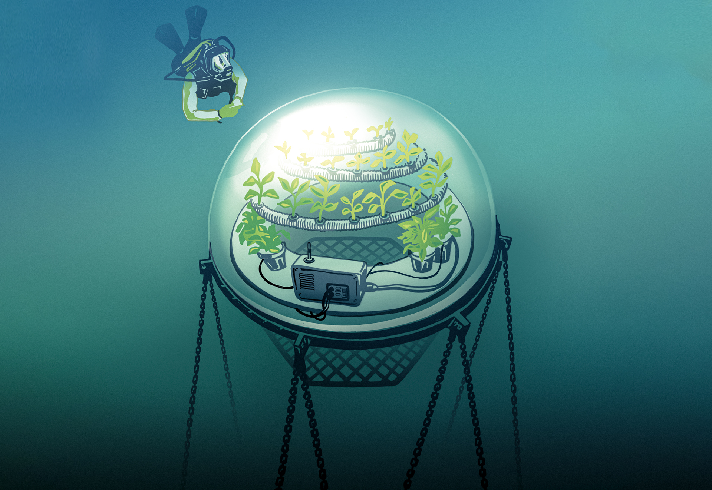
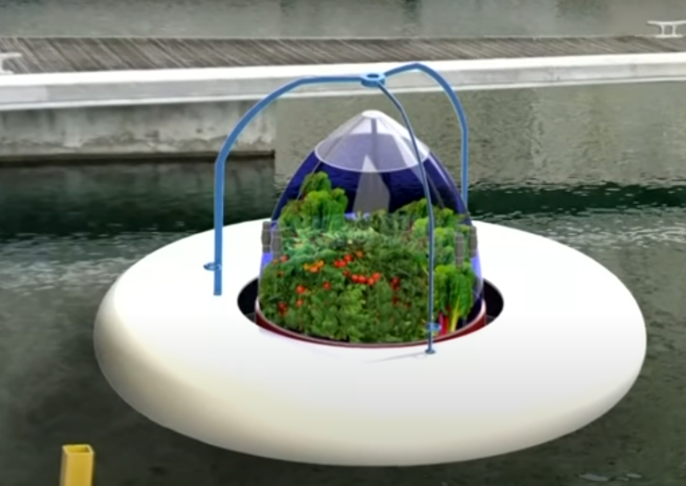

## Prototipo de huerto flotante con agua desalinizada mediante evaporación con energía solar  /  Prototype of a floating garden with desalinated water through evaporation using solar energy

### Planteamiento del problema / Problem statement

La escasez de agua es ya un problema mundial y una realidad nacional en Chile; donde en 2022 el Ministerio de obras públicas, a través de la Dirección General de Aguas decretó zona de escasez hídrica a diversas provincias del país, representando el 47,5% de la población. Según un estudio de esta misma institución (DGA, 2020), en Chile se proyecta un aumento de temperatura entre 1 y 2,5 °C con una baja de precipitaciones que indica una reducción de hasta 50% entre el 2030 y 2060 en algunas zonas del país. Esto es especialmente relevante para las regiones del norte y del centro de Chile, que se enfrentan a una amenaza real de escacez de agua. De igual forma, otro problema al que algunas comunidades se ven afectadas es la falta de terrenos cultivables, que las obligan a depender de la importación para abastecerse de vegetales y hortalizas. Ejemplo de esto lo podemos ver en la isla de Rapa Nui y demás zonas insulares, donde los precios de estos alimentos son considerablemente más altos que en Chile Continental (De Vicenzi, 2023).

Water scarcity is already a global problem and a national reality in Chile; where in 2022 the Ministry of Public Works, through the General Directorate of Water (DGA in Spanish), decreed areas of water scarcity in various provinces of the country, representing 47.5% of the population. According to a study by this same institution (DGA, 2020), in Chile a temperature increase between 1 and 2.5 °C is projected with a drop in precipitation of up to 50% between 2030 and 2060 in some areas of the country. This is especially relevant for the northern and central regions of Chile, which face a real threat of water leakage. Likewise, another problem that some communities are affected by is the lack of arable land, which forces them to depend on imports to supply themselves with vegetables. An example of this can be seen on the island of Rapa Nui and other island areas, where the prices of these foods are considerably higher than in Continental Chile (De Vicenzi, 2023).

------

### Estado del Arte / State of the art

En lo que se refiere a sistemas de recolección de agua dulce hay un sinfín de técnicas y dipositivos que sirven, algunos con mayor éxito que otros. Sin embargo, para nuestro proyecto nos centraremos en sistemas de recolección de agua que aprovechan la evaporación de esta a través de la exposición a los rayos del sol. Específicamente a través de técnicas que crean un sistema invernadero, aprovechando la condensación. Estudios como como Lachhab et al. (2021) y Sevilla y Follari (2023) ya han comprobado la efectividad de este tipo de técnicas para la desalinización de agua. Y ya existen prototipos funcionales en el mercado como WaterPod o HELIO WATER que utilizan estas técnicas. Sin embargo, aún tienen un gran reto a superar por dalente: No son capaces de generar los volúmenes de agua de una desalinizadora convencional. Pero, ¿y si la cantidad de agua recolectada fuera suficiente para la agricultura a pequeña escala?, esta es la idea que han explorado iniciativas como la de Nemo's garden en Italia y la de Leila Clark en Reino Unido, uniendo la idea de la obtención de agua con la agricultura a pequeña escala creando así prototipos que han probado ser funcionales en sus respectivos países. Este técnica de cultivo tiene varias ventajas:

* Ahorro de recursos hídricos
* Aprovechamiento de espacios donde antes no se podía cultivar
* Autosuficiencia de las comunidades
* Hace innecesario el uso de pesticidas
  
When it comes to freshwater collection systems, there are countless techniques and devices that serve, some with greater success than others. However, for our project we will focus on water collection systems that take advantage of water evaporation through exposure to the sun's rays. Specifically through techniques that create a greenhouse system, due to condensation. Studies such as Lachhab et al. (2021) and Sevilla and Follari (2023) have already verified the effectiveness of this type of techniques for water desalination. And there are already functional prototypes on the market such as WaterPod or HELIO WATER that use these techniques. However, they still have a great challenge to overcome: They are not capable of generating the volumes of water from a conventional desalination plant. But what if the amount of water collected was sufficient for small-scale agriculture? This is the idea that initiatives such as the one by Nemo's garden in Italy and the one by Leila Clark in the United Kingdom have explored, uniting the idea of ​​obtaining water trough solar evaporation with small-scale agriculture thus creating prototypes that have proven to be functional in their respective countries. This cultivation technique has several advantages:

* Saving water resources
* Taking advantage of spaces where cultivation could not be done before
* Community self-sufficiency
* Makes unnecessary the use of pesticides

------

### Nuestra propuesta / Our Proposal

Nuestra propuesta consiste en la construcción e implementación de un prototipo experimental de huerto flotante, el cual ya hemos modelado en 3D. Este prototipo será desplegado en el muelle Barón en Valparaíso, Quinta Región, Chile. Contará con una serie de sensores, incluyendo sensores de temperatura y humedad, controlados por Arduino, todos ellos alimentados por energía solar. Además, incorporaremos una cámara para grabar el entorno y monitorear el huerto en tiempo real. Gracias a la tecnología 5G, se podrá acceder a una transmisión en vivo de los datos y del video, lo cual no sería posible sin esta avanzada tecnología. Estos datos permitirán la elaboración de un informe final con un análisis detallado, proporcionando una base sólida para futuros estudios.

Prototipo versión 1:

* 40 cm de diámetro.
* Cúpula redondeada de 12,5 cm de alto.
* Espacio para 4 celdas solares.
* Espacio para 2 sensores de humedad y temperatura.
* Cámara para monitorización remota
* Sistema de anclaje al lecho marino.

Our proposal involves the construction and implementation of an experimental floating garden prototype, which we have already modeled in 3D. This prototype will be deployed in Baron pier in Valparaíso, Quinta Region, Chile. It will feature a series of sensors, including temperature and humidity sensors, controlled by Arduino and powered by solar energy. Additionally, we will incorporate a camera to record the environment and monitor the garden in real-time. Thanks to 5G technology, live streaming of data and video will be possible, which would not be achievable without this advanced technology. These data will enable the creation of a final report with a detailed analysis, providing a solid foundation for future studies.

Prototype version 1:

* 40 cm in diameter.
* Rounded dome 12.5 cm high.
* Space for 4 solar cells.
* Space for 2 humidity and temperature sensors.
* Camera for remote monitoring
* Anchoring system to the seabed.

